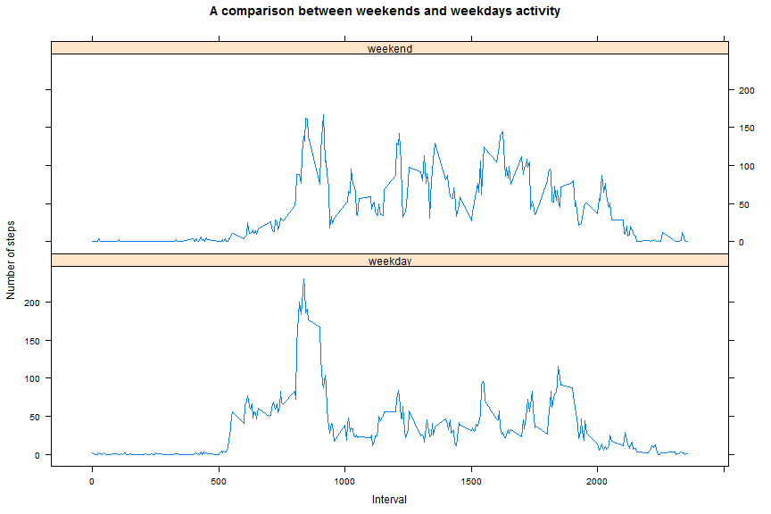

# Reproducible Research: Peer Assessment 1

## Introduction

It is now possible to collect a large amount of data about personal movement using activity monitoring devices such as a Fitbit, Nike Fuelband, or Jawbone Up. These type of devices are part of the "quantified self" movement - a group of enthusiasts who take measurements about themselves regularly to improve their health, to find patterns in their behavior, or because they are tech geeks. But these data remain under-utilized both because the raw data are hard to obtain and there is a lack of statistical methods and software for processing and interpreting the data.

This assignment makes use of data from a personal activity monitoring device. This device collects data at 5 minute intervals through out the day. The data consists of two months of data from an anonymous individual collected during the months of October and November, 2012 and include the number of steps taken in 5 minute intervals each day.

## Preparation
1. Set working directory

```r
# setwd("C:/Users/Angashley/Desktop/CourseraR learning/Reproducible Research/Week2/RepData_PeerAssessment1")
# Personal details edited out
```

2. Load packages to be used 

```r
library(dplyr)
library(ggplot2)
library(knitr)
library(lattice)
```

3. Set global options

```r
opts_chunk$set(echo = TRUE, fig.width=12, fig.height=8, fig.path='Figs/', cache=TRUE)

inline_hook <- function(x) {
  if (is.numeric(x)) {
    format(x, digits = 2)
  } else x
}
knit_hooks$set(inline = inline_hook)
```

## Loading and preprocessing the data

1. Load the data and examine the data

```r
if(!(file.exists("activity.csv"))) {unzip("activity.zip", "activity.csv")}

activity <- read.csv("activity.csv")
head(activity)
```

```
##   steps       date interval
## 1    NA 2012-10-01        0
## 2    NA 2012-10-01        5
## 3    NA 2012-10-01       10
## 4    NA 2012-10-01       15
## 5    NA 2012-10-01       20
## 6    NA 2012-10-01       25
```

```r
str(activity)
```

```
## 'data.frame':	17568 obs. of  3 variables:
##  $ steps   : int  NA NA NA NA NA NA NA NA NA NA ...
##  $ date    : Factor w/ 61 levels "2012-10-01","2012-10-02",..: 1 1 1 1 1 1 1 1 1 1 ...
##  $ interval: int  0 5 10 15 20 25 30 35 40 45 ...
```

2. Process/transform the data into a format suitable for analysis


```r
activity <- tbl_df(activity)
activity$date <- as.Date(activity$date, format ="%Y-%m-%d")
```

## What is mean total number of steps taken per day?

For this part of the assignment, the missing values in the dataset are ignored.


```r
Activitycomplete <- activity[complete.cases(activity),]
```


1. Calculate the total number of steps taken per day


```r
stepsDaily <- Activitycomplete %>% 
                group_by(date) %>% 
                summarise(steps = sum(steps))
head(stepsDaily,10)
```

```
## # A tibble: 10 x 2
##          date steps
##        <date> <int>
## 1  2012-10-02   126
## 2  2012-10-03 11352
## 3  2012-10-04 12116
## 4  2012-10-05 13294
## 5  2012-10-06 15420
## 6  2012-10-07 11015
## 7  2012-10-09 12811
## 8  2012-10-10  9900
## 9  2012-10-11 10304
## 10 2012-10-12 17382
```

2. Make a histogram of the total number of steps taken each day


```r
ggplot(data=stepsDaily, aes(stepsDaily$steps)) + 
        geom_histogram(bins = 11, 
                       color = "blue", 
                       fill = "blue",
                       alpha = 1/5) + 
        ggtitle("Total number of steps taken per day") +
        labs(x = "", y = "Frequency")
```

<!-- -->

3. Calculate and report the mean and median of the total number of steps taken per day


```r
stepsMean <- mean(stepsDaily$steps)
stepsMedian <-  median(stepsDaily$steps)
stepsMean
```

```
## [1] 10766.19
```

```r
stepsMedian
```

```
## [1] 10765
```
- The mean of the total number of steps taken per day is **10766**.
- The median of the total number of steps taken per days is **10765**.

## What is the average daily activity pattern?

1. Make a time series plot of the 5-minute interval and the average number of steps taken, averaged across all days


```r
stepsAverage <- Activitycomplete %>% 
                group_by(interval) %>% 
                summarise(stepsAverage = mean(steps))

ggplot(stepsAverage,aes(x = interval, y = stepsAverage)) +
        geom_line(color = "blue") +
        ggtitle("Average daily activity pattern") +
        labs(x = "Interval", y = "Number of steps") 
```

<!-- -->

2. Which 5-minute interval, on average across all the days in the dataset, contains the maximum number of steps?


```r
stepsMax <- which.max(stepsAverage$stepsAverage)
stepsAverage[stepsMax,]
```

```
## # A tibble: 1 x 2
##   interval stepsAverage
##      <int>        <dbl>
## 1      835     206.1698
```

Interval **835** contains the maximum number of steps (= **206**).

## Imputing missing values

Note that there are a number of days/intervals where there are missing values (coded as NA). The presence of missing days may introduce bias into some calculations or summaries of the data.

1. Calculate and report the total number of missing values in the dataset (i.e. the total number of rows with NAs)

```r
sum(is.na(activity$steps))
```

```
## [1] 2304
```

```r
sum(is.na(activity$interval))
```

```
## [1] 0
```

```r
sum(is.na(activity$date))
```

```
## [1] 0
```
The column **steps** in the dataset `activity` contains **2304** rows of NAs. The columns **interval** and **date** have no missing values.  

2. Devise a strategy for filling in all of the missing values in the dataset.

The average number of steps for 5-minute interval would be used to impute the missing value of the corresponding row in **steps**. `stepsAverage` contains the average data needed. 


```r
str(stepsAverage,10)
```

```
## Classes 'tbl_df', 'tbl' and 'data.frame':	288 obs. of  2 variables:
##  $ interval    : int  0 5 10 15 20 25 30 35 40 45 ...
##  $ stepsAverage: num  1.717 0.3396 0.1321 0.1509 0.0755 ...
```

3. Create a new dataset that is equal to the original dataset but with the missing data filled in.


```r
dataImp <- activity
for (i in stepsAverage$interval) {
    dataImp[dataImp$interval == i 
            & is.na(dataImp$steps), ]$steps <- 
            stepsAverage$stepsAverage[stepsAverage$interval == i]
}

head(dataImp)
```

```
## # A tibble: 6 x 3
##       steps       date interval
##       <dbl>     <date>    <int>
## 1 1.7169811 2012-10-01        0
## 2 0.3396226 2012-10-01        5
## 3 0.1320755 2012-10-01       10
## 4 0.1509434 2012-10-01       15
## 5 0.0754717 2012-10-01       20
## 6 2.0943396 2012-10-01       25
```

```r
sum(is.na(dataImp$steps))
```

```
## [1] 0
```

4. Make a histogram of the total number of steps taken each day 


```r
stepsTotal <- dataImp %>% 
        group_by(date) %>% 
        summarise(steps = sum(steps))

ggplot(data = stepsTotal, aes(steps)) + 
        geom_histogram(bins = 11, 
                       color = "blue", 
                       fill = "blue",
                       alpha = 1/5) + 
        ggtitle("Total number of steps taken per day\n(Imputed dataset)") +
        labs(x = "", y = "Frequency")
```

<!-- -->

5. Calculate and report the mean and median total number of steps taken per day. 


```r
stepsImpMean <-  mean(stepsTotal$steps)
stepsImpMedian <- median(stepsTotal$steps)
stepsImpMean
```

```
## [1] 10766.19
```

```r
stepsImpMedian
```

```
## [1] 10766.19
```
- The mean of the total number of steps taken per day in imputed dataset is **10766**.
- The median of the total number of steps taken per days in imputed dataset is **10766**.

6. Do these values differ from the estimates from the first part of the assignment? What is the impact of imputing missing data on the estimates of the total daily number of steps?


```r
p1 <- ggplot(data = stepsTotal, aes(steps)) + 
        geom_histogram(bins = 11, 
                       color = "blue", 
                       fill = "blue",
                       alpha = 1/5) + 
        ggtitle("Total number of steps taken per day\n(Imputed dataset)") +
        labs(x = "", y = "Frequency") + ylim(0,25)

p2 <- ggplot(data=stepsDaily, aes(stepsDaily$steps)) + 
        geom_histogram(bins = 11, 
                       color = "blue", 
                       fill = "blue",
                       alpha = 1/5) + 
        ggtitle("Total number of steps taken per day\n(NAs Ignored)") +
        labs(x = "", y = "Frequency") + ylim(0,25)

library(grid)
pushViewport(viewport(layout = grid.layout(1, 2)))
print(p1, vp = viewport(layout.pos.row = 1, layout.pos.col = 1))
print(p2, vp = viewport(layout.pos.row = 1, layout.pos.col = 2))
```

<!-- -->

You may see the mean here is equal to the mean from the first part of the assignment, and the median here is slightly bigger than before.

Using the average number of steps in 5-minute interval to impute missing data makes more data points equal to the mean (indicated by a bigger frequency in the `imputed dataset` histogram), and as a result of this, the median is likely to be more close to the mean.

## Are there differences in activity patterns between weekdays and weekends?

For this part, use the dataset with the filled-in missing values. The weekdays() function may be of some help.

1. Create a new factor variable in the dataset with two levels - "weekday" and "weekend" indicating whether a given date is a weekday or weekend day.


```r
dataImp$day <- weekdays(dataImp$date)

for (i in 1:nrow(dataImp)) {
        if (dataImp[i,]$day %in% c("Saturday","Sunday"))
        {
        dataImp[i,]$day <- "weekend"
        } 
        else {
          dataImp[i,]$day <- "weekday"
        }
}

dataImp$day <- as.factor(dataImp$day)

str(dataImp)
```

```
## Classes 'tbl_df', 'tbl' and 'data.frame':	17568 obs. of  4 variables:
##  $ steps   : num  1.717 0.3396 0.1321 0.1509 0.0755 ...
##  $ date    : Date, format: "2012-10-01" "2012-10-01" ...
##  $ interval: int  0 5 10 15 20 25 30 35 40 45 ...
##  $ day     : Factor w/ 2 levels "weekday","weekend": 1 1 1 1 1 1 1 1 1 1 ...
```

2. Make a panel plot containing a time series plot (i.e. type = "l") of the 5-minute interval (x-axis) and the average number of steps taken, averaged across all weekday days or weekend days (y-axis).


```r
stepsMean <- dataImp %>% 
                group_by(interval,day) %>% 
                summarise(steps = mean(steps))

xyplot(steps ~ interval | day, data = stepsMean, 
       type="l", layout = c(1,2),
       ylab="Number of steps", 
       xlab="Interval", 
       main="A comparison between weekends and weekdays activity")
```

<!-- -->
As shown from the panel plot, more steps are taken during the weekends than weekdays, and the peak time of steps taken is in the early stage of the day. 

## References  
[1]: [Github Peer Assessment](https://github.com/rdpeng/RepData_PeerAssessment1)

[2]: [Reproducible Research Coursera Course created by Johns Hopkins University](https://www.coursera.org/learn/reproducible-research)

[3]: [How to Make a Histogram with ggplot2](https://www.r-bloggers.com/how-to-make-a-histogram-with-ggplot2/)

[4]: [Conditioning and Grouping with Lattice Graphics](https://www.r-bloggers.com/conditioning-and-grouping-with-lattice-graphics/)

